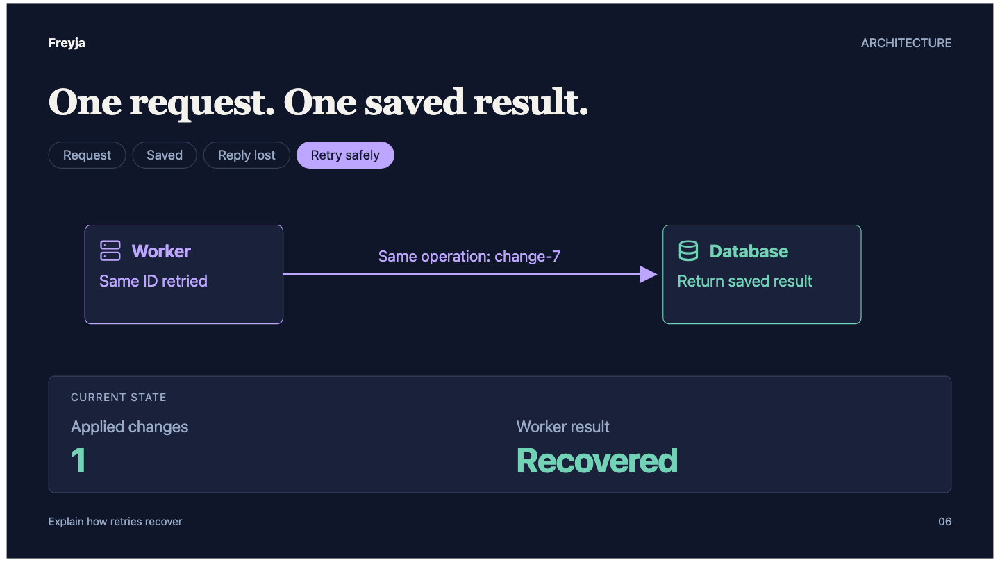
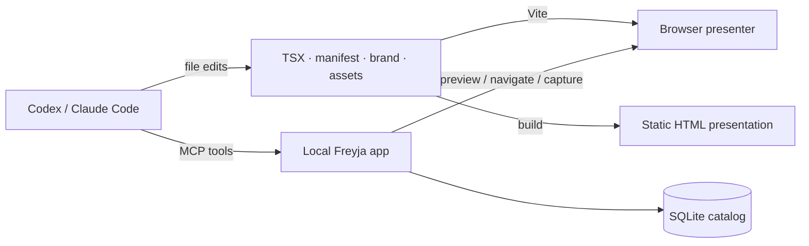

<p align="center">
  
</p>

# Freyja

**Explain complex topics through interactive presentations, one step at a time.**

Freyja turns ordinary React/TSX source into HTML slides with progressive reveals,
interaction demos and adaptable branding. An agent writes the source; a local MCP
app lets it preview, inspect, navigate, capture and build the presentation.



Use the included **Codex or Claude Code plugin** to shape the story and refine it
with you. The browser is the presenter interface: arrow keys, visible step tabs,
a searchable slide jump list, overview and fullscreen.

Freyja is experimental and local only. It runs trusted presentation source on your
machine. It is distributed from this repository; there is no npm release yet.

## Start

Requires Git and **Node.js 24+**.

```sh
mkdir -p "$HOME/repos"
git clone https://github.com/coadan/freyja.git "$HOME/repos/freyja"
cd "$HOME/repos/freyja"
npm ci
node scripts/cli.mjs create --id my-talk --title "My presentation"
node scripts/cli.mjs preview --id my-talk
```

Open the returned preview URL. The scaffold demonstrates a story, an interaction,
a flow and recovery from failure. Replace its example content with your topic.
Edit `deck.json`, `brand.json`, `slides/*.tsx`, CSS and assets in the returned
source directory; preview refreshes when files change.

Install Chromium for screenshots and browser checks:

```sh
npx playwright install chromium
node scripts/cli.mjs capture --id my-talk --slide recovery --step 3
node scripts/cli.mjs validate --id my-talk
node scripts/cli.mjs build --id my-talk
```

A build is a static directory you can serve over HTTP without the Freyja app.
Imported assets are bundled; remote resources remain remote.

## Create with an agent

Both plugins use the same skill, MCP tools and application checkout. After the
quick start, install either plugin from the repository root:

**Codex**

```sh
codex plugin marketplace add .
codex plugin add freyja@freyja-local
```

**Claude Code**

```sh
claude plugin marketplace add .
claude plugin install freyja@freyja-local
```

Start a new session, then ask:

> Use Freyja to explain this repository's architecture through concrete
> interactions, one step at a time, using its branding.

The skill guides story structure, visual pacing and review. Agents edit source
files directly. MCP creates scaffolds and operates presentations; it has no source
patching or slide reordering tool.

See [plugin setup](docs/plugins.md) for alternate checkout locations, a direct
stdio MCP connection and development validation.

## Present

| Control | Action |
| --- | --- |
| Right / Space | Next step, then next slide |
| Left | Previous step, then previous slide |
| Step tabs | Jump within an interaction |
| G | Search and jump to a slide |
| O | Slide overview |
| F | Fullscreen |
| Escape | Close jump or overview |

Stable slide IDs give durable `#/slide-id/step` links when the deck is reordered.
Custom diagrams, simulations, maps and other demos are ordinary React in the deck.
The SDK supplies optional layouts and reveal helpers; it does not prescribe scenes.

## How it fits together



Source files are authoritative. SQLite keeps catalog and inspection/build metadata.
Navigation has one position shared by keys, tabs, URLs and MCP. Topic-specific
behavior and branding remain in each presentation.

## Documentation and development

- [Documentation index](docs/README.md)
- [Architecture](docs/architecture.md)
- [CLI and local data](docs/cli.md)
- [Authoring reference](plugin/skills/engaging-presentations/references/authoring.md)
- [Presentation craft](plugin/skills/engaging-presentations/references/storycraft.md)
- [Contributing](CONTRIBUTING.md) · [Security](SECURITY.md)

```sh
npm ci
npx playwright install chromium
npm run check
```

Checks cover types, real MCP/service behavior, direct source edits, browser
navigation, two themes, screenshots and standalone exports. Compilation does not
establish visual quality: review entry, intermediate and final interaction states.

## License

[MIT](LICENSE). The generated pixel logo is included under the same license.
