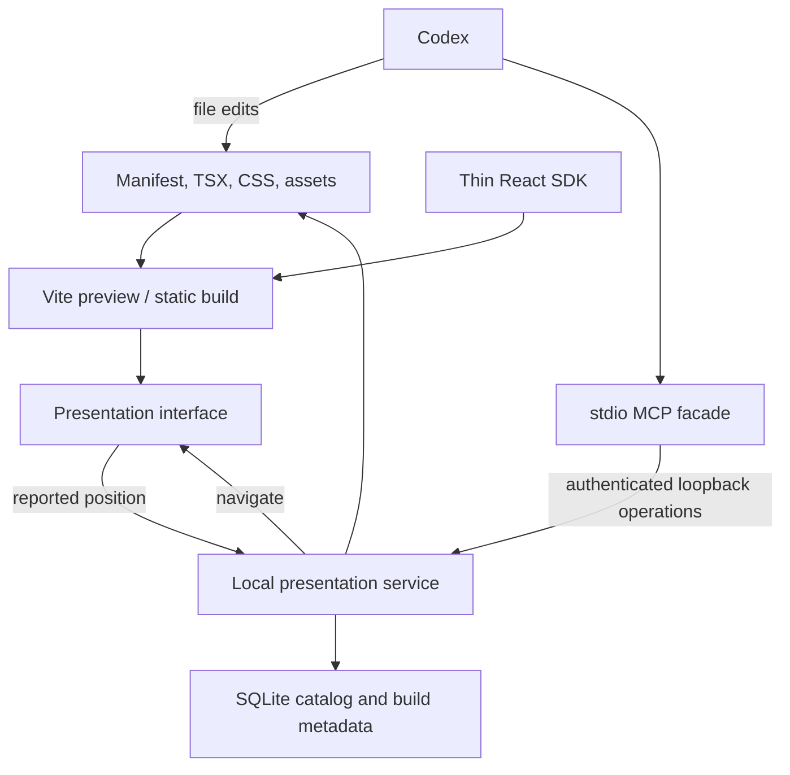

# Local architecture

The application is one Node process with per-presentation Vite middleware.
MCP instances connect to that shared service instead of opening independent catalogs.
CLI startup uses a local lock, and service discovery stores a loopback URL and
credential in a private runtime file. Bind to 127.0.0.1; reject foreign hosts/origins.

The service scaffolds and registers directories, inspects source, starts previews,
captures isolated steps and compiles static bundles. Authored behavior is ordinary
TSX. MCP cannot patch files. It returns absolute source paths to normal file tools.

`deck.json` owns order, stable IDs, titles and step labels. The player owns exactly
one `{slideId, step}` position. Keys, tabs, jump, URL and MCP navigation update that
position; Reveal receives its derived slide/fragment position. Slide components
render from `step`. No topic-specific behavior belongs in this controller.

The SDK offers optional visual/reveal helpers. Chat, maps, diagrams and other
demonstrations live in deck files. Themes are separate JSON tokens; custom CSS
and assets are imported normally. No mandatory presentation narrative is imposed
by code. The skill advises decomposition, demos and review.

SQLite indexes source locations, last inspected hashes and build outcomes. It does
not store slide content or provide historical source recovery. Files/Git own that.
Source graph inspection parses static imports without evaluating TSX; computed
runtime asset paths aren't inferred. Preview/build execute trusted source through
Vite; this isn't an untrusted-code hosting platform.

Validation checks manifest references, TSX syntax and bundling. It doesn't prove
layout, narrative quality or the architecture shown in a simulation. Browser tests
and screenshot review establish artifact behavior; source claims need their own
evidence. There are no presentation notes, editing or management views in the app.

The design deliberately uses the existing React/Reveal approach. Custom interactions
remain expressive without expanding a JSON behavior language. A future plugin can
package new templates or skills without changing the presentation engine.
